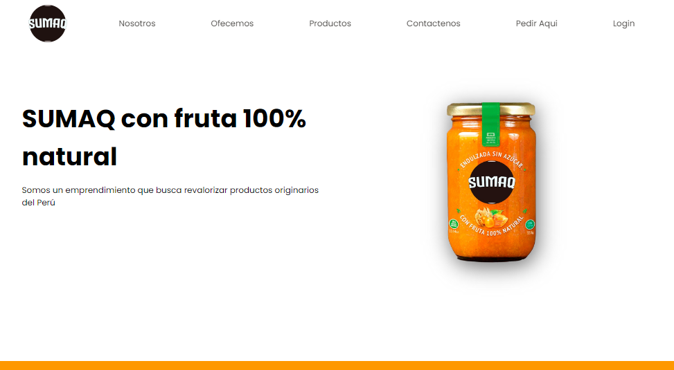

# Sumaq

Proyecto académico que se basa en un negocio que busca revalorizar productos originarios del Perú los cuales son consumidos desde la época de los Incas por su alto valor nutricional y por sus beneficios a las distintas afecciones que sufre el ser humano, Sumaq ofrece estos productos elaborados naturales contribuyendo aún más a la salud y bienestar de nuestros clientes.

